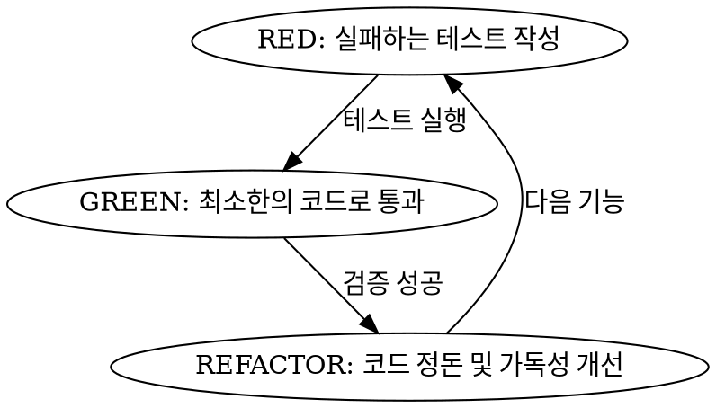

# 07. TDD 구현 스킬 (07-implementation-tdd)

> **Superpowers `test-driven-development` 기반**: 기능 추가 및 구현 시 실패하는 테스트를 먼저 작성하는 RED-GREEN-REFACTOR 사이클을 엄격히 준수합니다.

---

## 🚦 사전 승인 조건 (절대 규칙)

- 03단계에서 작성한 계획서와 상세 사양서를 사용자가 명시적으로 구현 승인한 경우에만 이 스킬을 사용합니다.
- 승인 기록이 없으면 테스트 작성 및 수정, 코드·설정 파일 수정, 빌드, 배포를 수행하지 않습니다.
- 이 경우 계획서와 사양서를 다시 제시하고 구현 승인 요청 상태를 유지합니다.

---

## 🔄 RED - GREEN - REFACTOR 사이클

### 1. RED (실패하는 테스트 우선 작성)

- 실제 구현 코드를 작성하기 전에 실패하는 테스트 코드를 먼저 작성합니다.
  - 프론트엔드: `frontend/tests/*.test.tsx`
  - 백엔드: `backend/src/test/java/.../*Test.java`
- 테스트를 실행하여 의도대로 실패(RED)하는지 확인합니다.

### 2. GREEN (최소 코드로 통과)

- 테스트를 통과시키기 위한 최소한의 구현 코드만 작성합니다.
- 조기 리팩토링이나 과도한 엔지니어링을 피하고 오직 테스트 통과에 집중합니다.

### 3. REFACTOR (리팩토링)

- 테스트가 통과(GREEN)된 후, 중복을 제거하고 구조를 개선합니다.
- 리팩토링 후에도 테스트가 계속 통과하는지 재검증합니다.

---

## ⚙️ S-ERP 프로젝트 전용 필수 구현 규칙

### 🎨 프론트엔드 (React / Vite / Vitest)

1. **MUI TextField 마진**: `MuiTextField.defaultProps.margin: 'normal'`로 인한 셀 내부 정렬 비틀림 방지를 위해 셀 에디터에는 `margin="none"`을 명시합니다.
2. **타이머 상태 분리**: 1초 카운트다운 state 등 주기적 틱 발생 상태는 페이지 최상위에 두지 말고 독립 리프 컴포넌트(`SessionCountdownLabel.tsx`)로 분리해 부모 리렌더링 및 TreeView 훅 루프를 차단합니다.
3. **와일드카드 라우팅 딥링크**: Playwright 검증 시 `/dashboard/*` 딥링크 직접 진입 대신 UI 클릭 이동을 모사합니다.

### ☕ 백엔드 (Java / Spring Boot / eGovFrame / MyBatis)

1. **TenantContextHolder 세팅**: JWT 인증 필터 및 DB 접근 전 `TenantContextHolder`에 tenantId/dbKey가 세팅되었는지 확인합니다.
2. **eGovAbstractDAO 연동**: raw 타입 상속 및 `select(...)` 캐스팅 사용.
3. **MyBatis XML 비교문**: XML `if test` 문자열 비교 시 이중 따옴표 사용 (`test='active == "Y"'`). OGNL `NumberFormatException`을 방지합니다.
