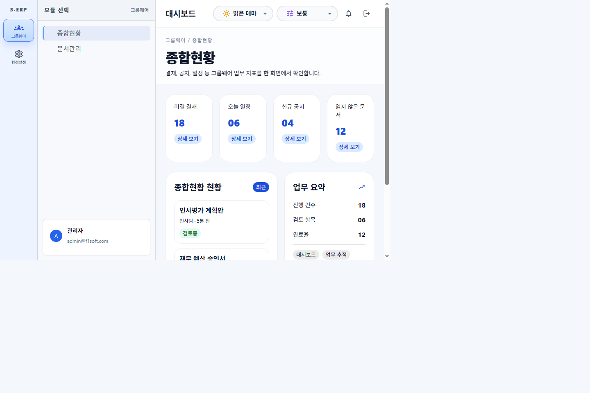
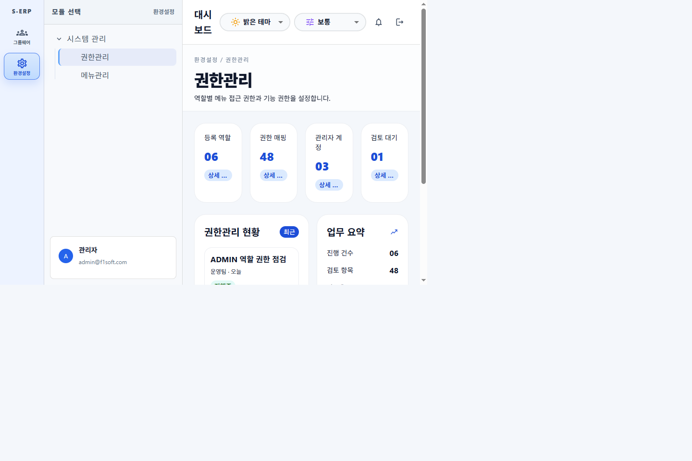

# 20260827_006 모듈-메뉴 권한 목업 데이터 구성 결과

- 작업지시서: [20260827*006*모듈*메뉴*권한*목업*데이터*구성*작업지시서.md](../../../directions/20260827/20260827_006_모듈_메뉴_권한_목업_데이터_구성_작업지시서.md)
- 계획서: [20260827*006*모듈*메뉴*권한*목업*데이터*구성*계획.md](../../../plan/20260827/20260827_006_모듈_메뉴_권한_목업_데이터_구성_계획.md)
- 사양서: [20260827*006*모듈*메뉴*권한*목업*데이터\_사양.md](../../../spec/20260827/20260827_006_모듈_메뉴_권한_목업_데이터_사양.md)

## 1. 변경 파일

| 파일                                                      | 내용                                                       |
| --------------------------------------------------------- | ---------------------------------------------------------- |
| `frontend/src/pages/dashboard/data/adminUserMenus.json`   | 신규. admin 사용자 기준 모듈-메뉴-권한 목업 응답           |
| `frontend/src/pages/dashboard/services/menuService.ts`    | 신규. 목업 응답 → 모듈/메뉴 트리 변환, 권한 조회 제공      |
| `frontend/src/pages/dashboard/types/dashboard.ts`         | 메뉴 권한/응답 타입 추가, `MenuTreeNode` 필드 확장         |
| `frontend/src/pages/dashboard/services/dashboardData.tsx` | 하드코딩 모듈 제거, 목업 기반 `moduleItems` 및 콘텐츠 정비 |
| `frontend/src/pages/dashboard/DashboardPage.tsx`          | 라우팅 기본값을 목업 메뉴 데이터 기준으로 변경             |
| `frontend/tests/menu-permissions.test.ts`                 | 신규. 데이터 계약 및 admin 권한 검증                       |
| `frontend/tests/dashboard-sidebar.test.tsx`               | 새 모듈/메뉴 구성 기준으로 수정                            |

## 2. 구성된 데이터

| 모듈           | menuId | 메뉴              | 경로                   | admin 권한(R/C/U/D) |
| -------------- | ------ | ----------------- | ---------------------- | ------------------- |
| 그룹웨어 (100) | 110    | 종합현황          | /groupware/overview    | true/true/true/true |
| 그룹웨어 (100) | 120    | 문서관리          | /groupware/documents   | true/true/true/true |
| 환경설정 (200) | 210    | 시스템 관리(그룹) | /settings/system       | -                   |
| 환경설정 (200) | 211    | 권한관리          | /settings/system/roles | true/true/true/true |
| 환경설정 (200) | 212    | 메뉴관리          | /settings/system/menus | true/true/true/true |

사용자: `{ "userId": "admin", "roles": ["ADMIN"] }`

## 3. 검증 결과

- `npm run build`: 성공
- `npm run test`: 5개 파일 / 14개 테스트 모두 통과
- 브라우저 확인
  - 로그인 후 `/dashboard/groupware/overview`로 진입
  - 모듈 레일에 그룹웨어, 환경설정만 노출
  - 환경설정 선택 시 `/dashboard/settings/roles`로 이동하고 시스템 관리 그룹 하위에 권한관리/메뉴관리 표시

## 4. 스크린샷

## 5. 영향 범위

- 프론트엔드 대시보드 데이터/서비스 계층 및 관련 테스트에 한정
- 백엔드 및 DB 변경 없음 (SQL 스크립트 대상 아님)

## 6. 후속 과제

- 실제 API 연동 시 `menuService`의 데이터 원천만 서버 응답으로 교체
- `getMenuPermission` 결과를 화면 버튼/액션 제어에 연결
