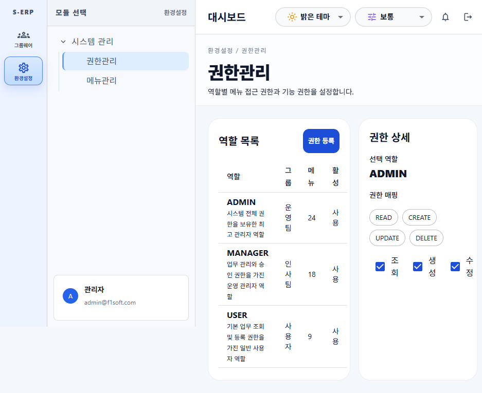
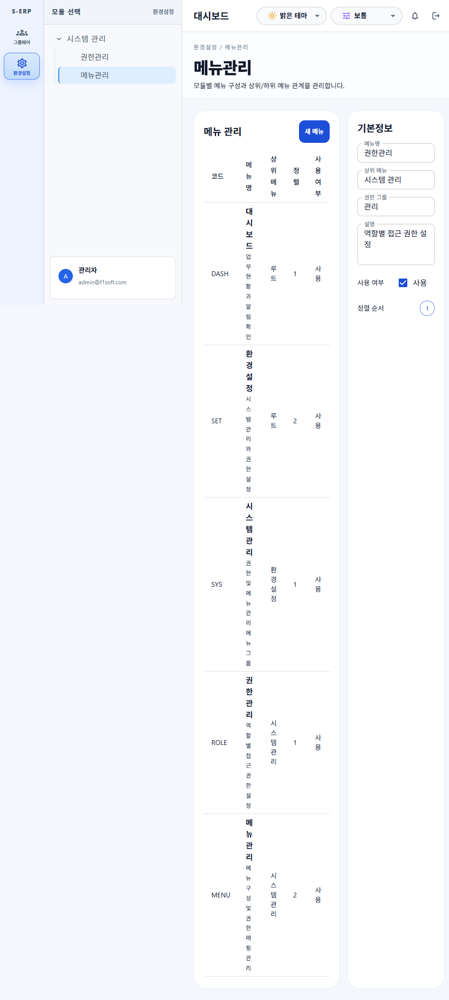

# 시스템 관리 페이지 소유권 정리 결과

## 1. 작업 내용

환경설정 > 시스템 관리 하위의 권한관리와 메뉴관리 화면 전용 코드를 각 페이지 폴더로 이동했다.

- 권한관리 페이지
  - `frontend/src/pages/settings/system/roles/RoleManagementPage.tsx`
  - `frontend/src/pages/settings/system/roles/components/RoleManagementPanel.tsx`
  - `frontend/src/pages/settings/system/roles/data/roleManagement.data.ts`
  - `frontend/src/pages/settings/system/roles/services/roleManagement.service.ts`
  - `frontend/src/pages/settings/system/roles/types/roleManagement.types.ts`
  - `frontend/src/pages/settings/system/roles/hooks/`
- 메뉴관리 페이지
  - `frontend/src/pages/settings/system/menus/MenuManagementPage.tsx`
  - `frontend/src/pages/settings/system/menus/components/MenuManagementPanel.tsx`
  - `frontend/src/pages/settings/system/menus/data/menuManagement.data.ts`
  - `frontend/src/pages/settings/system/menus/services/menuManagement.service.ts`
  - `frontend/src/pages/settings/system/menus/types/menuManagement.types.ts`
  - `frontend/src/pages/settings/system/menus/hooks/`

대시보드 폴더에서는 두 관리 페이지 전용 패널, 샘플 데이터, 행 타입을 제거했다. 대시보드 셸과 공통 메뉴 트리/페이지 분기 동작은 유지했다.

## 2. 검증 결과

- `npm exec vitest run tests/system-management-ownership.test.ts`: 통과 (2개 테스트)
- `npm run build`: 통과
- `npm run test`: 통과 (6개 파일, 17개 테스트)
- dashboard 내 관리 페이지 전용 패널/타입 참조 검색: 페이지 폴더 내부 참조만 확인

## 3. 영향 범위

- 프론트엔드 페이지 구조와 import 경로에 한정
- 기존 URL, 화면 텍스트, 샘플 데이터 표시, 대시보드 라우팅 동작 유지
- 백엔드 및 DB 변경 없음
- 정적 목업 데이터만 사용하므로 별도 훅/API 서비스는 추가하지 않음

## 4. 화면 확인

