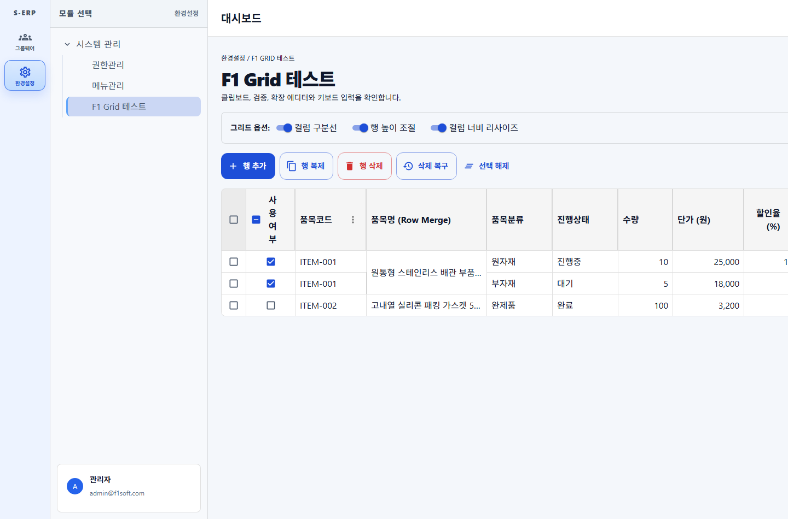
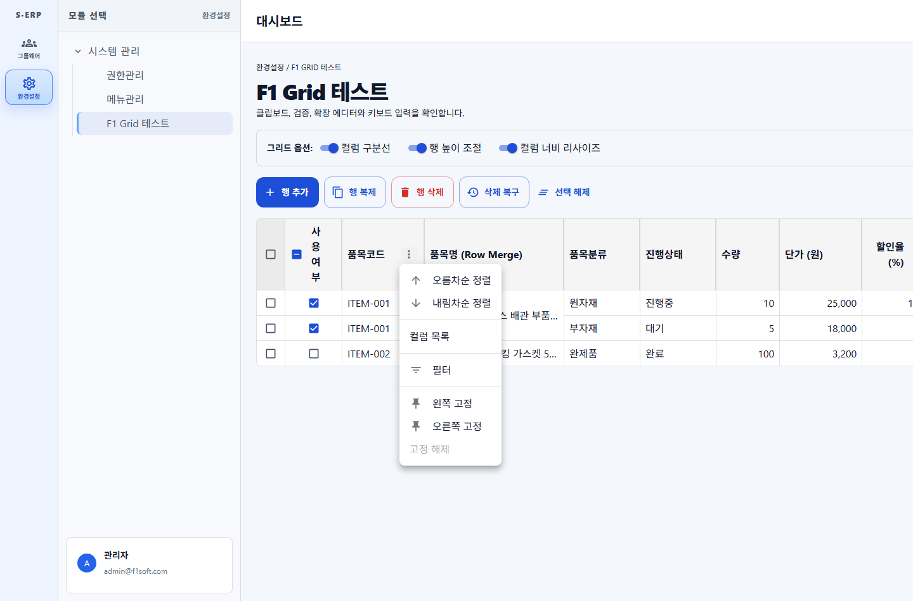
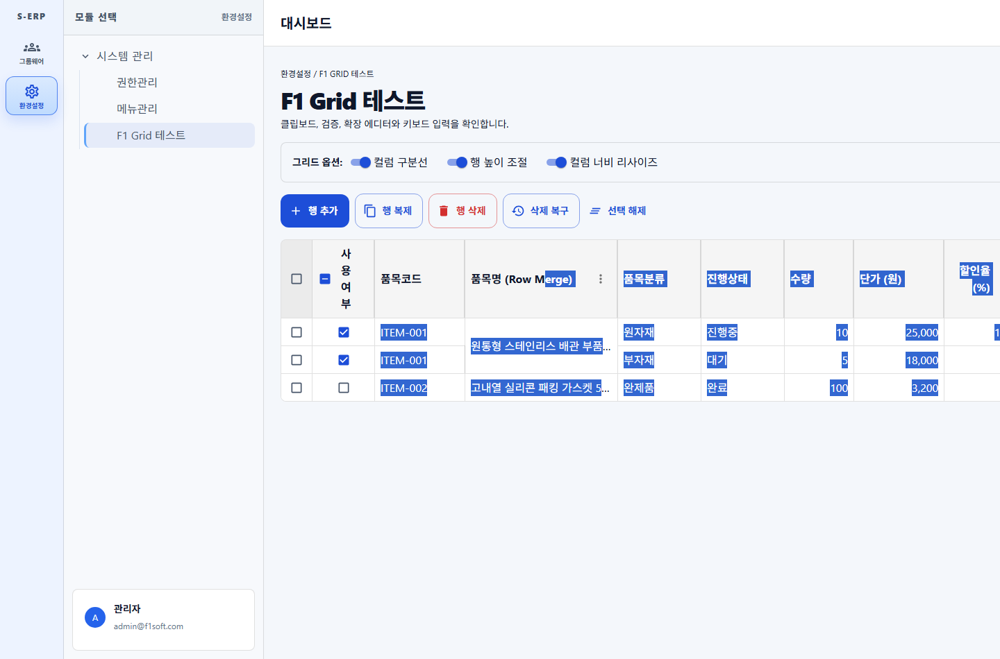
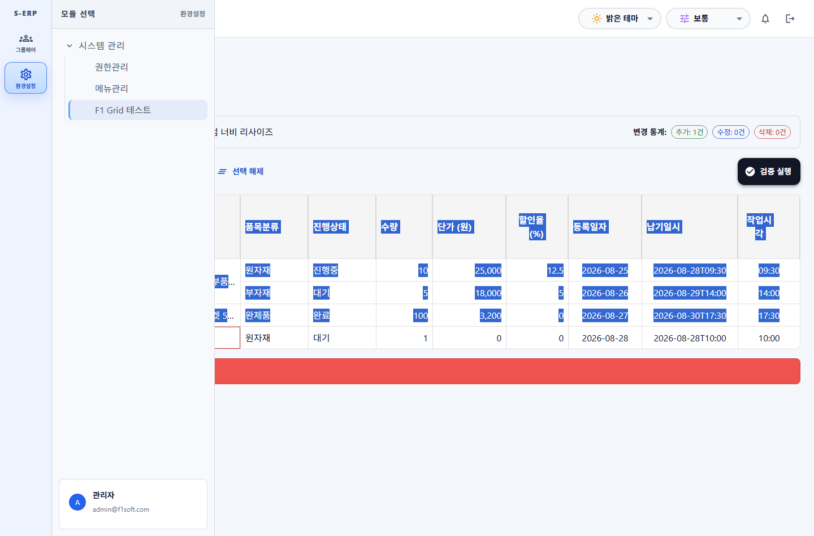
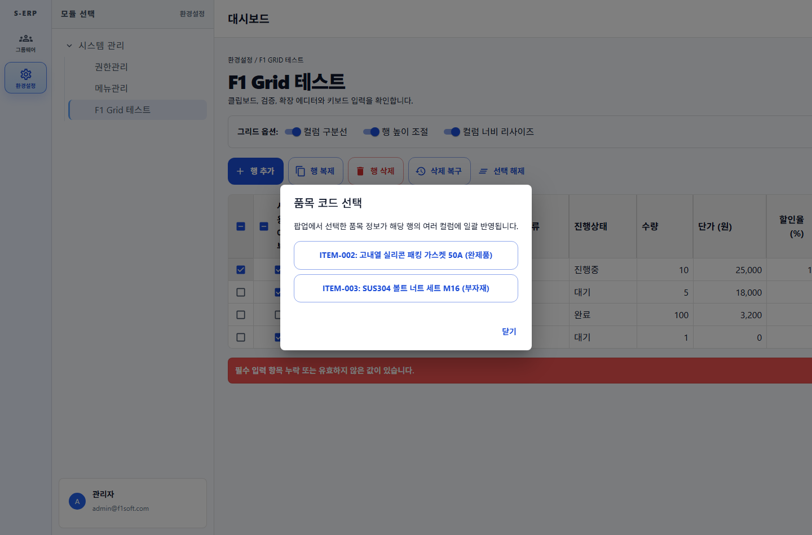

# 결과 보고서: F1-GRID 컬럼 리사이즈, 헤더 메뉴 개선 및 전 기능 종합 테스트

- 문서 번호: 20260828_007
- 일자: 2026-08-28
- 관련 작업지시서: `docs/directions/20260828/20260828_007_F1-GRID_컬럼리사이즈_헤더메뉴개선_전체기능테스트_작업지시서.md`
- 관련 계획서: `docs/plan/20260828/20260828_007_F1-GRID_컬럼리사이즈_헤더메뉴개선_전체기능테스트_계획.md`
- 관련 사양서: `docs/spec/20260828/20260828_007_F1-GRID_컬럼리사이즈_헤더메뉴개선_전체기능테스트_사양.md`

---

## 1. 작업 개요

F1-GRID의 실무 사용자 경험 향상을 위해 마우스 드래그를 통한 **컬럼 너비 리사이즈 (Column Resizing)**, 헤더 마우스 오버 시에만 우측 끝에 나타나는 **더보기 메뉴 버튼 개선**, 그리고 11개 전체 에디터 타입과 모든 조작 액션을 망라한 **F1GridTestPage 종합 테스트 페이지 구축**을 완료하고 브라우저 검증을 마쳤습니다.

---

## 2. 주요 구현 내용

### 2.1 컬럼 너비 리사이즈 (Column Resize)

- **리사이즈 드래그 핸들**: 각 컬럼 헤더 우측 경계에 마우스 드래그 핸들(`role="separator"`, `cursor: col-resize`) 배치.
- **실시간 너비 연동**: 마우스 드래그 시 `columnWidths` 상태를 동적으로 계산하여 그리드 템플릿(`gridTemplateColumns`) 및 핀 오프셋(`leftOffsets`, `rightOffsets`)에 즉시 반영.
- **최소 너비 보호**: `minColumnWidth` (기본값 50px) 이하로 축소되지 않도록 보호.
- **옵션 토글 지원**: `resizableColumns` boolean 속성을 통해 리사이즈 활성/비활성화 제어.

### 2.2 헤더 더보기 메뉴 인터랙션 및 우측 끝 정렬

- **우측 끝 정렬**: 헤더 셀 내부 레이아웃을 Flex로 정비하여 제목/정렬/필터는 좌측에, 더보기 버튼은 `margin-left: auto`로 우측 끝에 배치.
- **호버 인터랙션**: 평소에는 숨겨져(`opacity: 0`) 있다가 헤더에 마우스를 올릴 때(`:hover`) 또는 메뉴가 열려있을 때 우측 끝에 부드럽게 노출(`opacity: 1`).

### 2.3 F1GridTestPage 전체 옵션/기능 종합 테스트 환경 구축

1. **11개 전체 에디터 타입 지원**:
   - `useYn`: 'checkbox' (헤더 전체 선택 `headerCheckbox: true`)
   - `itemCode`: 'code' (팝업 코드 픽커 다이얼로그 연동)
   - `itemName`: 'text' (연속 행 병합 `mergeRows: true`, 줄바꿈 `wrapText: true`)
   - `category`: 'select' (원자재/부자재/완제품 드롭다운)
   - `status`: 'autocomplete' (대기/진행중/완료/보류 자동완성)
   - `qty`: 'number' (최소 1 이상)
   - `price`: 'currency' (원화 통화 포맷)
   - `ratio`: 'decimal' (소수점 할인율)
   - `regDate`: 'date' (등록일자)
   - `deliveryAt`: 'datetime' (납기일시)
   - `workTime`: 'time' (작업시각)
2. **그리드 제어판 및 실시간 변경 통계**:
   - 그리드 옵션 토글: 컬럼 구분선(`columnLine`), 행 높이 조절(`resizableRows`), 컬럼 리사이즈(`resizableColumns`).
   - 변경 이력 실시간 집계: `onChangesChange` 연동을 통한 추가/수정/삭제 건수 칩 실시간 표기.
3. **그리드 조작 액션 툴바**:
   - 행 추가(`addRow`), 행 복제(`duplicateSelectedRows`), 행 삭제(`deleteSelectedRows`), 삭제 복구(`restoreDeletedRows`), 선택 해제(`clearSelection`), 유효성 검증(`validate`).

---

## 3. 검증 결과

### 3.1 단위 테스트 (Vitest)

- 전체 테스트 스위트 9개 파일 81개 테스트 전원 통과 완료.
  - `f1-grid.test.tsx` (55 tests 통과)
  - `f1-grid-test-page.test.tsx` (6 tests 통과)
  - `menu-management-f1-grid.test.tsx` (3 tests 통과)
  - `dashboard-sidebar.test.tsx`, `login.test.tsx` 등 전체 통과.

### 3.2 브라우저 E2E 캡처 및 화면 검증

| 화면 캡처                                                                   | 설명                                                            |
| --------------------------------------------------------------------------- | --------------------------------------------------------------- |
|          | 11개 에디터 컬럼, 제어판 스위치, 변경 통계, 조작 툴바 전체 화면 |
|       | 품목코드 헤더 셀 호버 시 우측 끝에 나타나는 더보기 메뉴 버튼    |
|               | 정렬, 컬럼 목록 숨김/해제, 필터, 고정 메뉴 팝업                 |
|             | 마우스 드래그로 품목코드 컬럼 너비 확장 조절된 화면             |
|    | 행 추가(추가 1건 칩 갱신) 및 유효성 검증 성공 알림              |
|  | 더블클릭 -> 코드 선택 팝업을 통한 다중 필드 일괄 패치           |

---

## 4. 최종 체크리스트

- [x] 컬럼 너비 마우스 드래그 리사이즈 및 최소 너비(50px) 보장 구현
- [x] 헤더 더보기 버튼 마우스 오버 시 활성화 및 우측 끝 정렬 스타일 적용
- [x] F1GridTestPage에 모든 11개 에디터 타입 및 모든 조작 액션 구현
- [x] 그리드 옵션 토글(구분선, 행높이조절, 컬럼리사이즈) 및 변경 통계 칩 연동
- [x] 단위 테스트(81개 전원 통과) 및 TypeScript 빌드 검증 완료
- [x] 브라우저 자동화 스크린샷 캡처 및 결과 보고서 작성 완료
