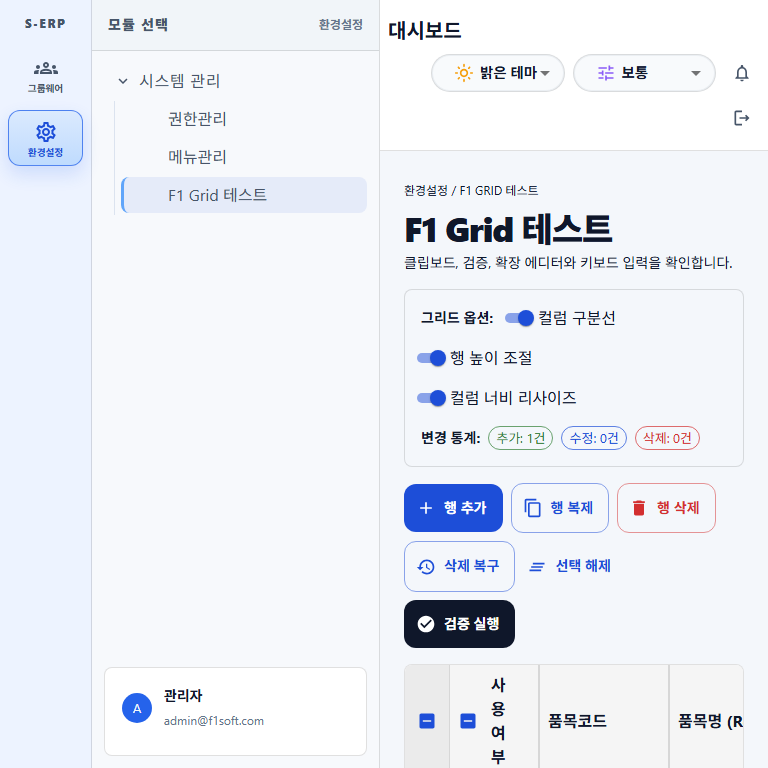

# 결과 보고서: F1-GRID 반응형 수평 스크롤

- 문서 번호: 20260828_008
- 일자: 2026-08-28
- 관련 작업지시서: `docs/directions/20260828/20260828_008_F1-GRID_반응형_수평스크롤_작업지시서.md`
- 관련 계획서: `docs/plan/20260828/20260828_008_F1-GRID_반응형_수평스크롤_계획.md`
- 관련 사양서: `docs/spec/20260828/20260828_008_F1-GRID_반응형_수평스크롤_사양.md`

---

## 1. 구현 내용

- `DashboardPage`의 사이드바 뒤 중앙 콘텐츠 flex item에 `minWidth: 0`을 적용했다.
- 좁은 중앙 콘텐츠 폭에서 앱 바 제어 영역이 줄바꿈되도록 하고, 900px 미만에서 패딩 및 선택 컨트롤 최소 폭을 줄였다.
- F1-GRID 루트에 `minWidth: 0` 및 `maxWidth: '100%'`를 적용하고 기존 `overflowX: 'auto'`를 유지했다.
- 헤더와 본문의 max-content 컬럼 폭은 유지되어, 초과 폭은 F1-GRID 내부 가로 스크롤로 표시된다.
- F1-GRID 루트의 축소 및 수평 스크롤 속성을 검증하는 Vitest 회귀 테스트를 추가했다.
- Playwright 캡처 스크립트에 768px 뷰포트 측정, 문서/그리드 수평 오버플로우, 계산된 `overflow-x` 검증을 추가했다.

## 2. 브라우저 검증

768px 뷰포트에서 다음 조건을 측정했다.

| 항목                        | 측정값 | 판정                          |
| --------------------------- | -----: | ----------------------------- |
| 문서 전체 폭                |  768px | 뷰포트 폭과 동일              |
| F1-GRID 표시 폭             |  338px | 중앙 콘텐츠 가용 폭으로 축소  |
| F1-GRID 콘텐츠 폭           | 1474px | F1-GRID 내부 수평 스크롤 발생 |
| F1-GRID 계산된 `overflow-x` | `auto` | F1-GRID가 수평 스크롤 소유    |

## 3. 검증 결과

- `npm run test -- tests/f1-grid.test.tsx`: 56개 테스트 통과.
- `node scripts/capture-f1-grid-full-test.js`: 좁은 뷰포트에서 문서 전체 가로 오버플로우 없음 및 F1-GRID 내부 수평 오버플로우 조건 통과.
- 변경 파일의 VS Code 진단: 오류 없음.
