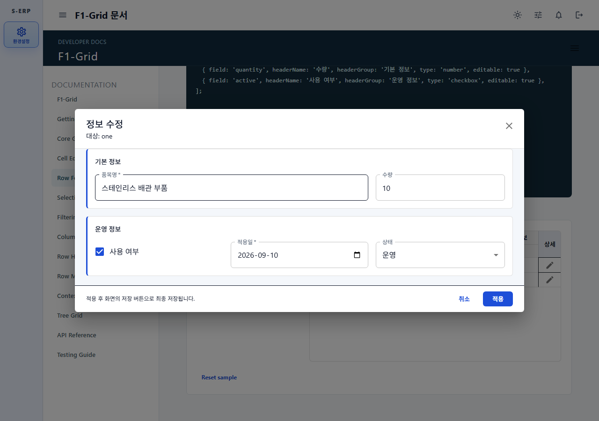
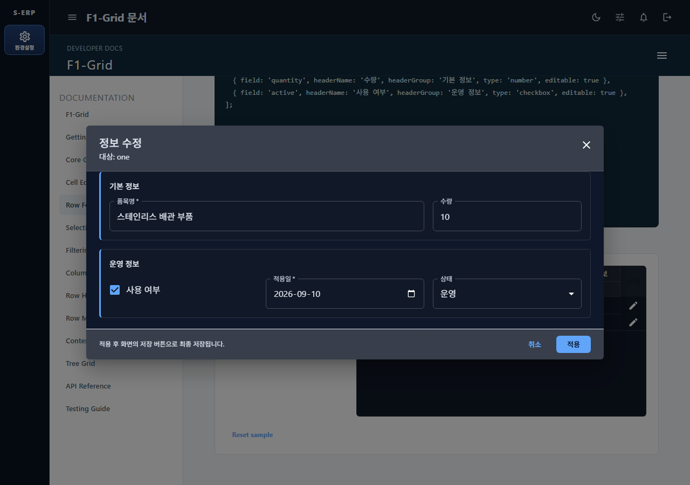
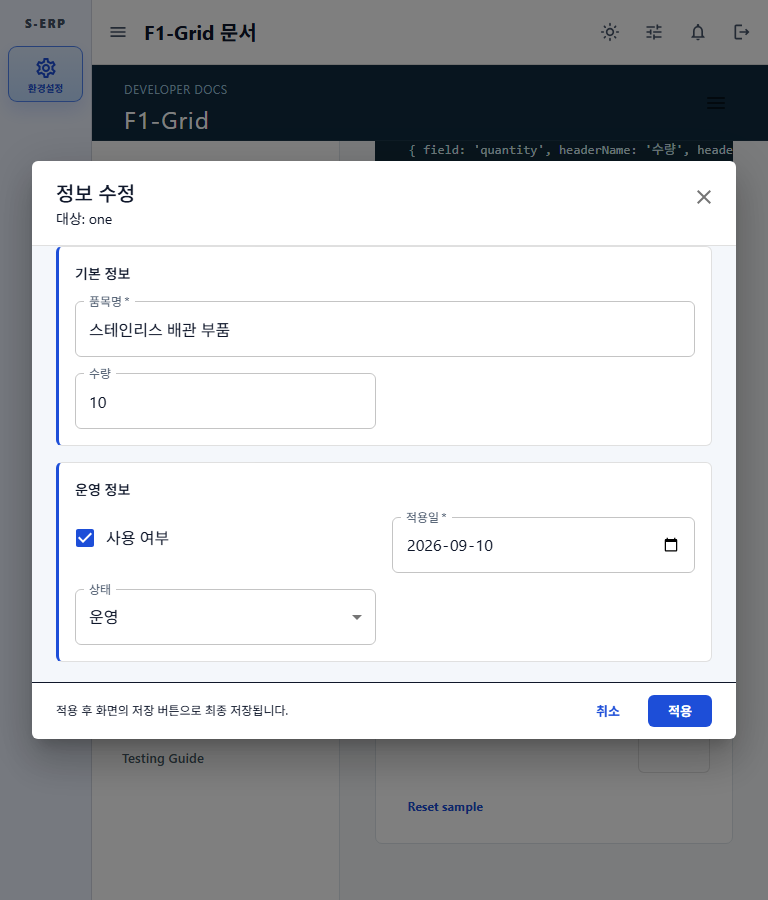
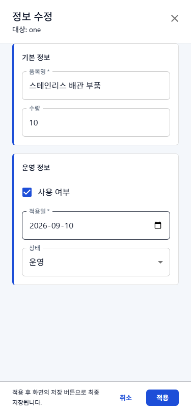

# F1-Grid/F1-Tree 행 폼 모달 플러그인 결과

## 개요

F1-Grid/F1-Tree에 선택적으로 활성화하는 행 폼 모달 플러그인을 추가했다. 플러그인을 등록하면 자동 액션 열과 신규·수정 모달을 사용하고, 등록하지 않으면 기존 인라인 편집과 즉시 행 추가 동작을 유지한다.

## 관련 문서

- [작업지시서](../../../directions/20260910/20260910_001_f1grid_tree_form_modal_plugin_작업지시서.md)
- [계획서](../../../plan/20260910/20260910_001_f1grid_tree_form_modal_plugin_계획서.md)
- [상세 사양서](../../../spec/20260910/20260910_001_f1grid_tree_form_modal_plugin_사양서.md)
- [상세 실행 계획](../../../superpowers/plans/2026-09-10-f1grid-tree-form-modal-plugin.md)
- [작업 원장](progress.md)

## 구현 결과

- `rowFormPlugin`이 활성화된 Grid/Tree에만 48px 우측 고정 `상세` 액션 열을 추가했다.
- 수정 모달은 행 복사본을 draft로 사용하며 `적용` 전에는 Grid 변경 상태를 수정하지 않는다.
- 신규 모달은 `createRow()`와 전달 patch로 draft를 만들고 `적용` 시에만 inserted 행을 생성한다.
- 컬럼 `type`, `headerName`, `headerGroup`, `required`, `min`, `max`, `validate`, `options`, `onValueChange`, `onOpenCodePicker`를 폼에 재사용한다.
- `form.hidden`, `form.readOnly`, `form.label`, `form.group`, `form.order`, `form.span`으로 자동 폼을 재정의할 수 있다.
- 동일 `headerGroup` 컬럼은 하나의 섹션으로 합치고 그룹이 없으면 `기본 정보`에 배치한다.
- F1-Tree 하위 등록은 부모 ID를 보존하고 적용 후에만 부모를 펼친다.
- MUI 테마 토큰으로 라이트·다크를 지원하고 1280px 3열, 768px 2열, 375px 1열/fullscreen으로 전환한다.
- 문서 포털에 실제 신규·수정 Playground와 API 설명을 추가했다.

## 주요 변경 영역

- `frontend/src/shared/components/f1-grid/form/`: 폼 모델, 타입별 필드, 전용 모달, 액션 셀
- `frontend/src/shared/components/f1-grid/core/`: 합성 액션 열과 신규·수정 상태 연결
- `frontend/src/shared/components/f1-grid/tree/`: 하위 등록 적용 후 부모 펼침
- `frontend/src/shared/components/f1-grid/types/`: 플러그인과 컬럼 폼 옵션 공개 타입
- `frontend/src/pages/f1-grid-docs/`: 문서와 실제 Playground
- `frontend/tests/`: 모델·필드·모달·Grid·Tree·문서 회귀 테스트
- `frontend/scripts/capture-f1-grid-form-modal.js`: 실제 브라우저 반응형·테마 검증

## 검증 결과

### 기능 테스트

```text
npx vitest run tests/f1-grid-form-modal.test.tsx tests/f1-tree.test.tsx tests/f1-grid-docs.test.tsx \
  -t "row form modal|without row form plugin|F1-Grid row form integration|documents and demonstrates the row form modal"

Test Files  3 passed
Tests       29 passed | 43 skipped
Exit code   0
```

### 빌드

```text
npm run build

TypeScript + Vite build passed
1,364 modules transformed
Exit code 0
```

기존 dynamic/static import 중복 및 대형 chunk 경고는 남아 있으나 빌드 오류는 없다.

### 전체 테스트 기준선 비교

```text
구현 전: 186 tests, 131 passed, 55 failed
구현 후: 229 tests, 175 passed, 54 failed
```

전체 테스트는 기존 dashboard 메뉴, role 알림, theme 설정 및 F1-Tree 정렬 메뉴 assertion 등의 실패 54건으로 Green이 아니다. 사용자 결정에 따라 기존 실패로 기록하고 기능 범위 구현을 진행했으며, 최종 보고에서 전체 테스트 성공으로 표현하지 않는다.

## 브라우저 검증

브라우저 검증 스크립트는 Dialog 경계, 페이지 가로 overflow, 계산된 폼 열 수, 모바일 fullscreen 및 PNG 크기를 assertion으로 확인했다.

| 화면           | 결과                                   |
| -------------- | -------------------------------------- |
| 1280x900 light | 3열, 960px Dialog, overflow 없음       |
| 1280x900 dark  | 3열, 960px Dialog, overflow 없음       |
| 768x900 light  | 2열, 704px Dialog, overflow 없음       |
| 375x812 light  | 1열, 375x812 fullscreen, overflow 없음 |

### 스크린샷









## 리뷰

- 모든 구현 태스크에서 사양 준수 리뷰와 코드 품질 리뷰를 수행했다.
- 최종 전체 리뷰: APPROVED
- 남은 Critical: 0
- 남은 Important: 0
- 지연 Minor: 동작 영향이 없는 표현·문서화·테스트 mock 방식 개선 제안

## DB 및 백엔드 영향

- 신규 API: 없음
- 백엔드 변경: 없음
- DB 변경: 없음
- DB 스크립트: 해당 없음, 영향 검토 완료

## 잔여 위험

- 전체 Vitest의 기존 실패 54건은 별도 정리가 필요하다.
- 열린 수정 모달의 대상 행이 외부 `rows` 갱신으로 삭제되면 적용은 no-op 후 닫힌다. 동시 삭제 충돌 정책은 이번 승인 범위에 포함되지 않았다.
- 현재 멀티헤더 계약은 기존 F1-Grid와 동일한 한 단계 `headerGroup`을 기준으로 한다.
