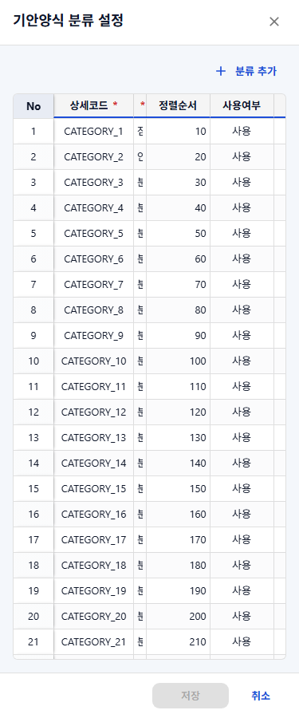
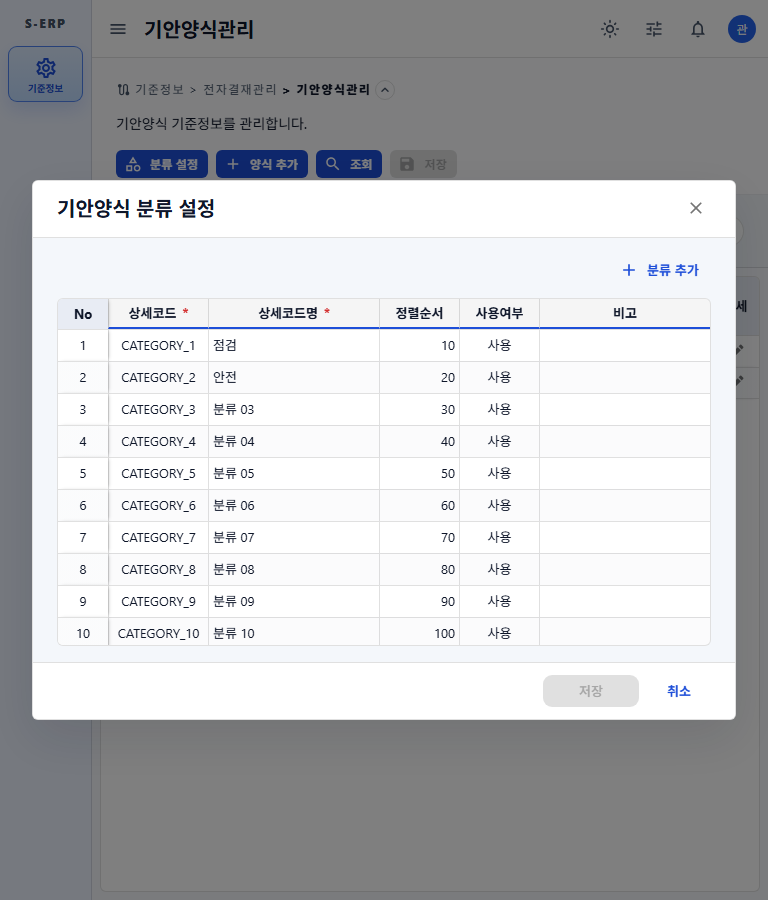
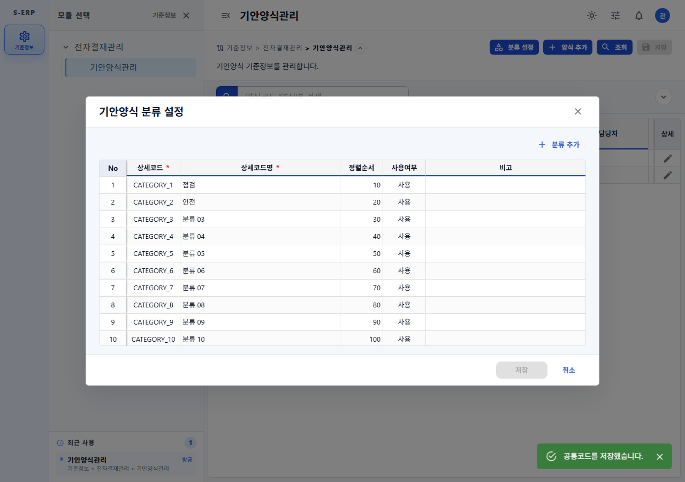
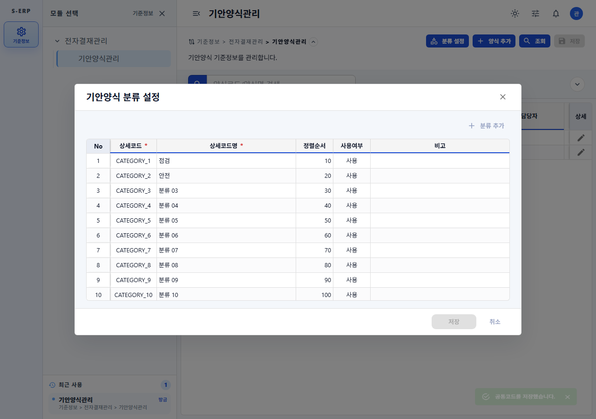

# 20261002_006 분류 설정 공통 모달 적용 결과

## 변경 내용

- 기안양식관리의 분류 설정 모달을 공통 `CommonDialog`로 이전했다.
- 기존 `paperHeight="60vh"`, 모바일 full-screen, F1-Grid 인라인 편집, 저장/실패/미저장 닫기 흐름을 유지했다.
- 본문 `DialogContent dividers`와 footer 직접 border를 제거했다. 공통 셸은 색상 prop 없는 MUI 기본 `Divider`를 footer 앞에 하나 렌더링하고 `DialogActions` 자체에는 border를 지정하지 않는다.
- F1-GRID 문서에 기본 footer Divider 규칙을 추가했다.

## 검증

- `common-dialog.test.tsx`, `common-code-item-help-dialog.test.tsx`, `f1-grid-form-modal.test.tsx`: 62개 테스트 통과.
- 기안양식관리 통합: F1-Grid 행 폼 진입/저장/수정/사용자 라벨 선택 4개 테스트 통과.
- `npm run build`: TypeScript 검사 및 Vite 프로덕션 빌드 통과.
- Playwright: 375px, 768px, 1280px에서 페이지 가로 넘침 0px; 375px 분류 설정 모달은 full-screen이고 Grid 내부 스크롤이 유지됨.
- 768px에서는 contained modal, 375px에서는 full-screen으로 표시되며 두 크기 모두 F1-Grid 내부 스크롤을 유지한다.
- 시각 캡처에서 분류 설정 모달의 본문 하단과 footer 사이에 중복선이 없고, 취소/저장 액션이 공통 footer 구분선 아래에 정렬됨을 확인했다.

## 스크린샷

- 375px 분류 설정: 
- 768px 분류 설정: 
- 1280px 분류 설정 및 footer: 
- 1280px 저장 성공 표시: 
