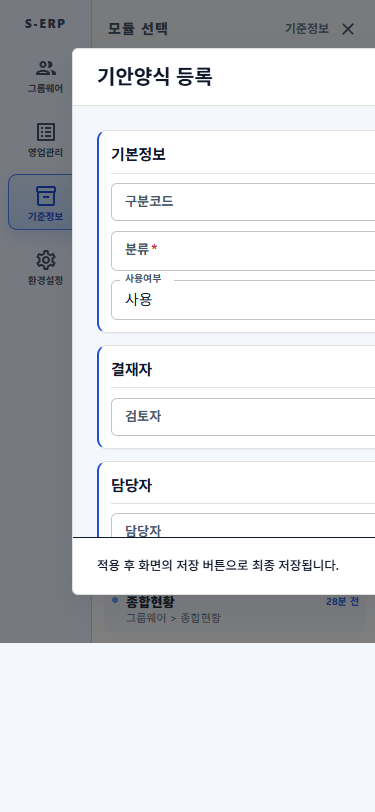
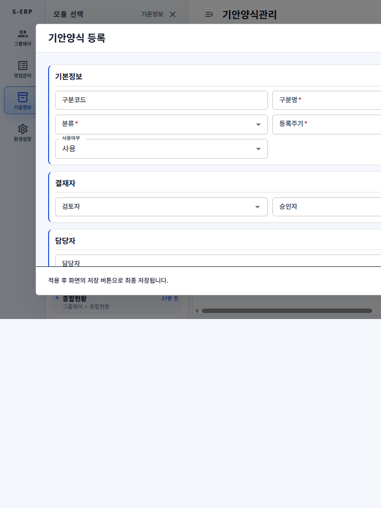
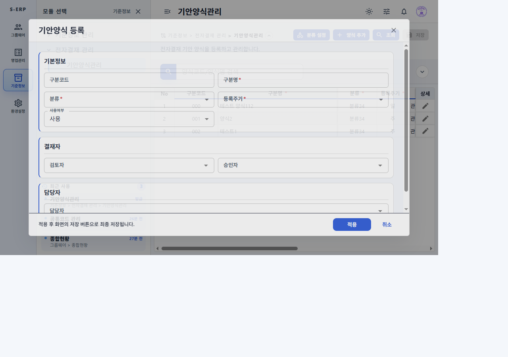
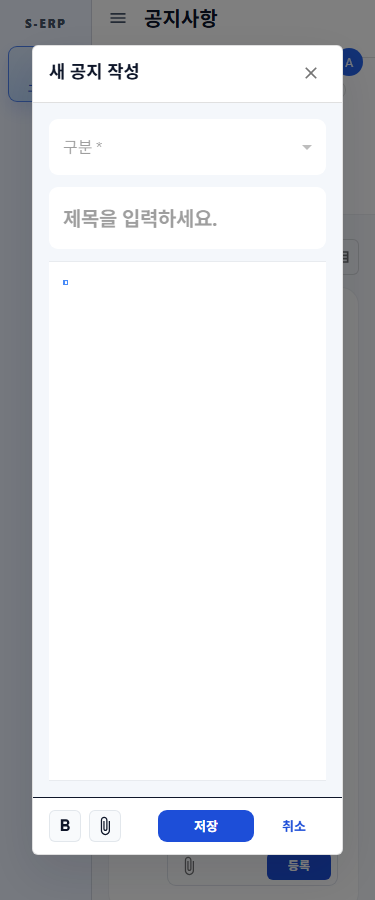
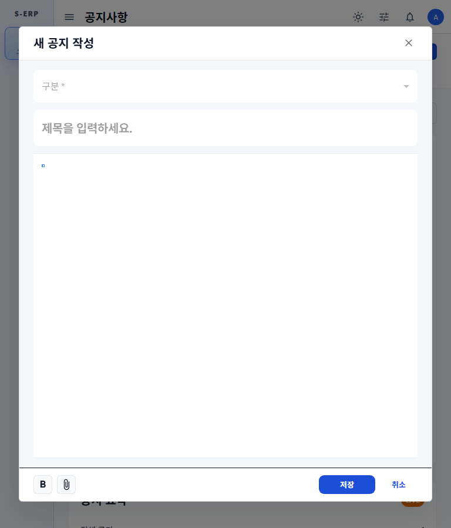
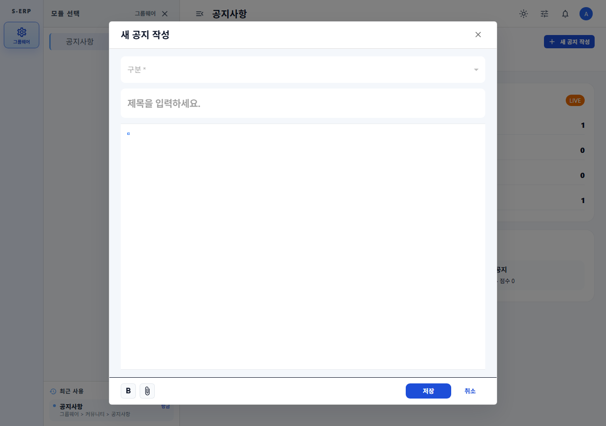
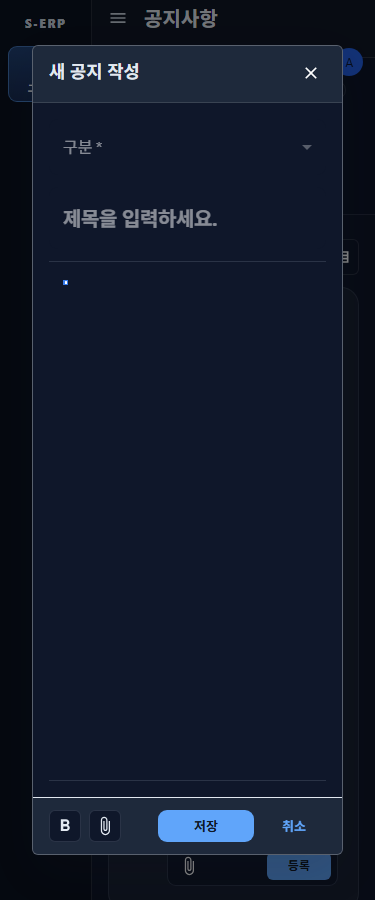
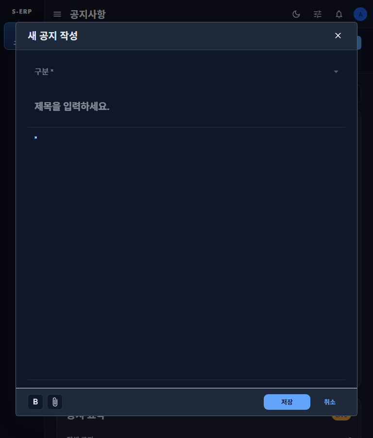
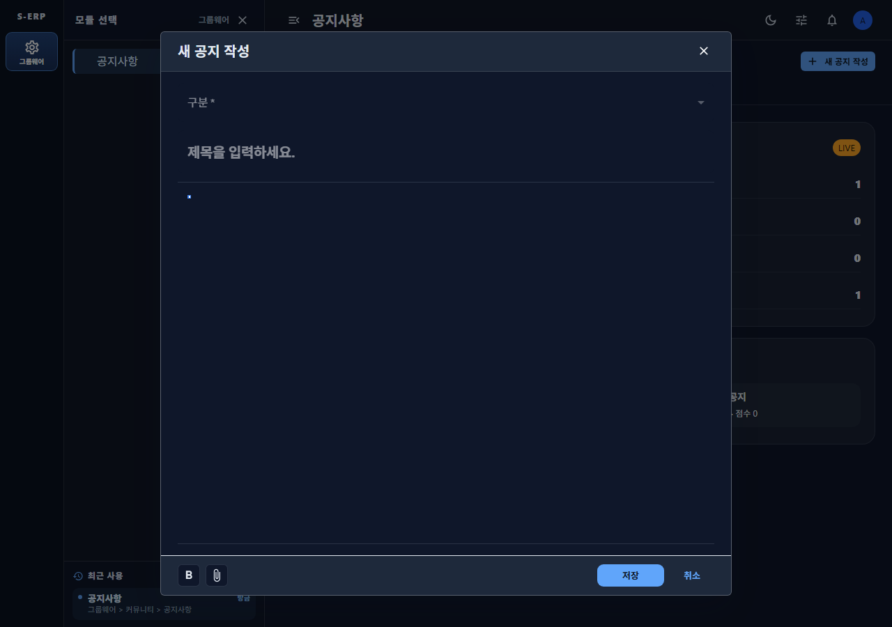

# 20261002_003 공통 모달 셸 통일 결과

## 변경 내용

- `frontend/src/shared/components/CommonDialog.tsx`를 추가해 공통 헤더·본문 스크롤·선택형 푸터를 제공한다.
- F1-Grid 행 폼을 공통 셸로 이전했다. 기존 960px/85vh 제한과 모바일 전체 화면, draft·검증·닫기 동작을 유지하고 최종 저장 안내를 푸터 좌측 슬롯으로 옮겼다.
- 그룹웨어 공지 작성 모달을 공통 셸로 이전했다. 편집/첨부 툴바는 좌측 `footerStart`, 저장/취소는 우측 액션 슬롯으로 전달하며 에디터/이미지/저장 동작을 유지한다.
- 기안양식관리는 기존 F1-Grid `rowFormPlugin` 경로를 통해 같은 셸을 사용한다.
- [F1-GRID 문서](../../../frontend/src/pages/f1-grid-docs/F1-GRID.md)는 행 폼 모달 외곽과 슬롯 규칙을 설명하도록 갱신했다.

### 다크 테마 후속 조정

- 공통 셸 paper/header/footer는 다크 모드에서 앱의 슬레이트 표면색 `#1e293b`를 사용하고, 본문은 페이지 바탕 `background.default`를 유지한다. 라이트 모드는 기존 `background.paper` 표면을 유지한다.
- 다크/라이트 배경 회귀 테스트를 추가해 모달 paper와 본문 색상 계약을 확인했다.
- 별도 dark viewport 브라우저 캡처는 `screenshots/dark/`에 저장한다.

## 검증 결과

- 집중 Vitest: `common-dialog.test.tsx`, `f1-grid-form-modal.test.tsx`, `notice-composer-dialog-theme.test.tsx` 3개 파일, 59개 테스트 통과.
- `npm run build`: TypeScript 검사 및 Vite 프로덕션 빌드 통과.
- 기안양식관리 Playwright 캡처: 375/768/1280px에서 문서 가로 넘침이 없고, 375px에서 행 폼 전체 화면 표시를 확인했다.
- 공지 작성 모달 Playwright 캡처: 375/768/1280px에서 모달이 viewport 안에 있고 `footerStart`와 액션 영역이 겹치지 않음을 확인했다.
- 다크 공지 모달 계산색: 3개 뷰포트 모두 paper/header/footer `rgb(30, 41, 59)`, 본문 `rgb(15, 23, 42)`로 측정했다.
- 전체 Vitest: 56개 파일 중 37개 통과, 19개 실패; 631개 테스트 중 477개 통과, 154개 실패 및 비동기 오류 10건. 보고된 실패에는 권한/메뉴 접근성, 테마 설정, 임시 디버그 테스트 및 CommonCode 트리 ref 오류가 포함되어 전체 테스트 게이트는 통과하지 못했다. 기안양식관리 단독 실행은 20개 중 19개 통과했으며, 실패 1건은 테스트가 `행 삭제` 메뉴 항목을 찾지 못한 케이스다. 공지 피드 페이지의 댓글 과거 항목 로드 테스트 2건도 버튼 이름 조회 실패가 관찰됐다.
- 기존 이미지 검증 스크립트의 전체 모드는 공지 모달 캡처 이후 피드 이미지 확장 단계에서 타임아웃됐다. `CAPTURE_MODAL_ONLY=true` 모드는 이미지 삽입 뒤 반응형 모달을 측정·캡처하고 정상 종료했다.

## 반응형 측정

| 화면           | 뷰포트 | 모달 경계   | 결과                |
| -------------- | -----: | ----------- | ------------------- |
| 기안양식 행 폼 |  375px | full-screen | 문서 overflow 0px   |
| 기안양식 행 폼 |  768px | 폭 960px    | 문서 overflow 0px   |
| 기안양식 행 폼 | 1280px | 폭 960px    | 문서 overflow 0px   |
| 공지 작성      |  375px | x=32..343   | 푸터 슬롯/액션 분리 |
| 공지 작성      |  768px | x=32..736   | 푸터 슬롯/액션 분리 |
| 공지 작성      | 1280px | x=230..1050 | 푸터 슬롯/액션 분리 |

## 스크린샷

### 기안양식 행 폼

- 375px: 
- 768px: 
- 1280px: 

### 공지 작성

- 375px: 
- 768px: 
- 1280px: 

### 공지 작성 다크 테마

- 375px: 
- 768px: 
- 1280px: 
