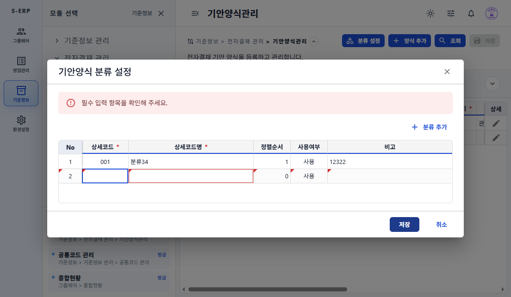

# 20261002_001 기안양식 분류 설정 필수 검증 결과보고서

## 결과

- 분류 설정 모달 저장 전에 `F1GridRef.validate()`를 실행한다.
- 필수 검증 실패 시 `필수 입력 항목을 확인해 주세요.`를 모달 안에 표시하고 API 호출을 중단한다.
- 저장 API 오류를 페이지 오류 콜백에 전파하지 않아 메인 그리드 오류 영역과 분리했다.
- F1-Grid 문서에 명시적 저장 시 `validate()` 사용 기준을 추가했다.

## 검증

- `tests/common-code-item-help-dialog.test.tsx`: 11/11 통과
- `tests/draft-form-management.test.tsx`: 추가한 두 회귀 시나리오 통과. 전체 19개 중 1개는 범위 외 양식 그리드 행 삭제 메뉴 테스트에서 접근성 이름 `행 삭제`를 찾지 못해 실패했다.
- `npm run build`: 통과
- 브라우저: 분류 설정에서 빈 행을 추가하고 저장했을 때 모달에 필수 안내 및 두 필수 셀 오류가 표시되고 메인 화면에는 동일 오류가 표시되지 않음을 확인했다. 미저장 테스트 행은 저장하지 않고 폐기했다.

## 스크린샷

