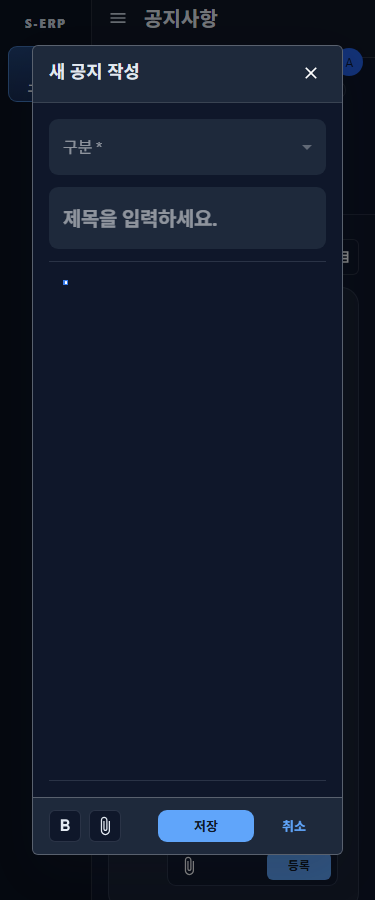
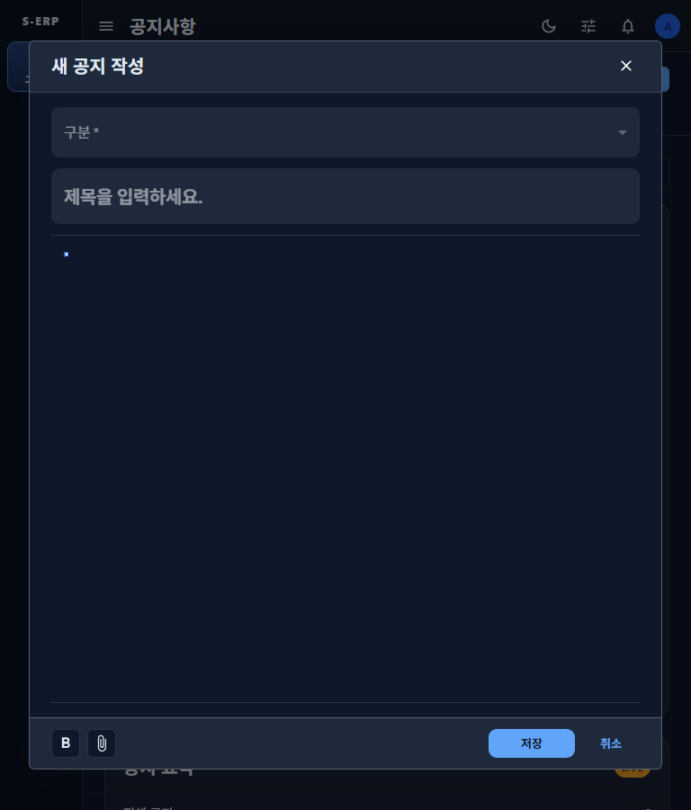
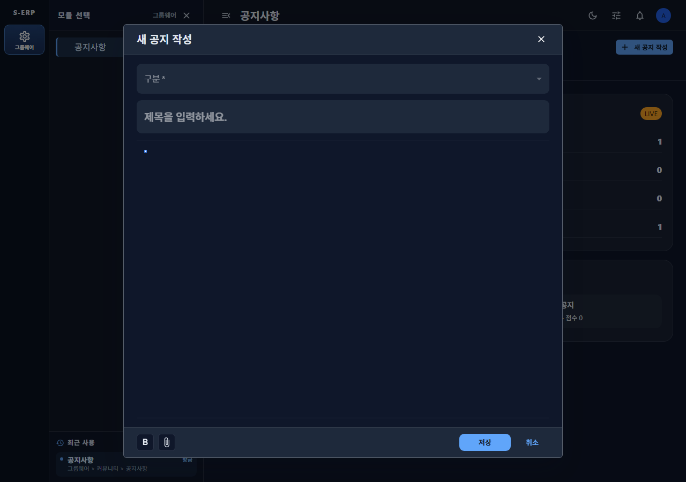

# 20261002_007 공지사항 작성 모달 다크 필드 배경 결과

## 변경 내용

- 공지 작성 모달의 구분·제목 입력에 전용 배경 토큰을 적용했다.
- 다크 모드에서 두 입력면은 `#1e293b`, 라이트 모드에서는 기존 흰색을 사용한다.
- 본문 편집 영역, 첨부 영역, 입력 동작과 저장 계약은 변경하지 않았다.

## 검증

- TDD RED: 다크 필드 배경 테스트가 기존 `rgb(15, 23, 42)`와 기대값 `rgb(30, 41, 59)` 차이로 실패함을 확인했다.
- `npm run test -- tests/notice-composer-dialog-theme.test.tsx`: 11개 테스트 통과. 다크 모드 구분·제목 입력은 `rgb(30, 41, 59)`, 라이트 모드 입력은 `rgb(255, 255, 255)`로 확인했다.
- `npm run build`: TypeScript 검사 및 Vite 빌드 통과.
- Playwright 다크 모드 브라우저 확인: 375px, 768px, 1280px에서 캡처했다. 모달은 viewport 안에 있고 푸터 슬롯과 액션 영역이 겹치지 않았다. 공통 셸의 paper/header/footer는 `rgb(30, 41, 59)`, 콘텐츠는 `rgb(15, 23, 42)`를 유지했다.
- 이번 변경을 위해 시작한 개발 서버는 종료했다. 기존 사용 중이던 4173 포트 서버는 건드리지 않았다.

## 스크린샷

- 375px: 
- 768px: 
- 1280px: 

## 영향 범위

공지 작성 모달의 구분·제목 입력면 색상만 변경했다. 공지 API, 데이터, 편집기 본문 배경, 모달 셸 및 저장 동작은 변경하지 않았다.
