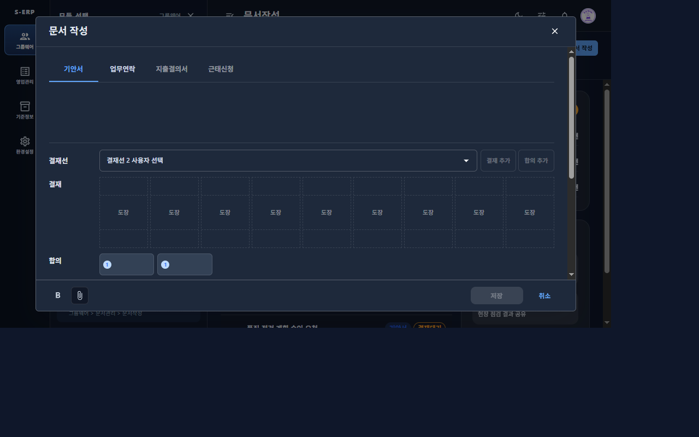
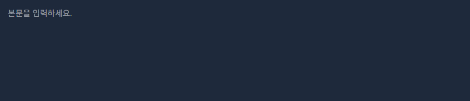

# 20261007_009 문서작성 다크 테마 합의 칩/에디터 배경 결과

## 변경 내용

- 합의 칩은 라이트 테마에서 기존 `grey.100`/`grey.300` 외관을 유지하고, 다크 테마에서는 `#334155` 배경, 테마 divider 테두리, 밝은 본문색을 사용한다.
- 에디터 캔버스, 편집 가능 영역, 첨부 영역은 라이트에서 `#ffffff`, 다크에서 공통 모달 본문과 같은 `#1e293b`를 사용한다.
- 본문 기본 텍스트는 theme `text.primary`, 본문 placeholder는 제목 필드와 동일한 theme `text.disabled`를 사용한다.
- 제목 입력은 굵게(`700`), 에디터 기본 본문은 일반 굵기(`400`)로 표시한다. 본문 사용자 서식은 유지한다.
- 첨부 파일 칩은 테마별 에디터 표면 위에서도 읽을 수 있도록 기존 어두운 텍스트/삭제 아이콘과 옅은 회색 배경을 유지한다.
- 합의 칩 사용자 선택·삭제, 결재선 저장 구조 및 기존 결재선 작업 변경은 유지했다.

## 검증

- TDD RED: 다크 에디터 기대 표면 `rgb(30, 41, 59)`와 기존 실제 흰 표면이 달라 실패했다. 타이포그래피 회귀 테스트도 본문 `fontWeight: 400`을 요구할 때 기존 computed 값이 `normal`로 확인되어 실패했다.
- 집중 검증: `npx vitest run tests/document-write-page.test.tsx -t "editor surface"` 3개 통과(라이트/다크 표면·글자 및 에디터 레이아웃), `npx vitest run tests/document-approval-fields-theme.test.tsx` 2개 통과.
- 전체 `document-write-page.test.tsx`: 37개 중 32개 통과, 결재선 UI 테스트 5개가 5초 timeout으로 실패했다. 실패는 승인/합의 배치와 결재선 레이아웃 테스트이며 이번 에디터 표면/타이포그래피 집중 테스트는 통과했다.
- 변경 파일 lint: 통과.
- `npm run build`: TypeScript 및 Vite 프로덕션 빌드 통과.
- 공유 브라우저 375px/768px/1280px 확인: 라이트 에디터 `rgb(255, 255, 255)`/텍스트 `rgb(15, 23, 42)`, 다크 에디터 `rgb(30, 41, 59)`/텍스트 `rgb(226, 232, 240)`였다. 두 테마 모두 제목 굵기 `700`, 본문 굵기 `400`; 본문 placeholder 색은 제목 placeholder와 같았다(라이트 `rgba(0, 0, 0, 0.38)`, 다크 `rgba(255, 255, 255, 0.5)`). 세 뷰포트 모두 가로 넘침이 없었다.
- 저장한 캡처는 에디터 캔버스와 placeholder만 포함하며 사용자 이름이나 문서 본문은 노출하지 않았다.

## 공유 결재선 테스트 실패

전체 `document-write-page.test.tsx` 실행에서 결재선/합의 UI 테스트 5건이 5초 timeout으로 실패했다. 표면/글자/타이포그래피 집중 테스트는 통과했으며, 이번 작업에서는 결재선 로직을 수정하지 않았다.

- `retains and wraps the fourth approval in a three-column grid`
- `hides the empty agreement row while preserving the remaining row order`
- `renders an approval participant in a table column with position, seal, sequence, and name`
- `renders each selected agreement user as a wrapped chip and appends the next selector`
- `keeps the empty approval selector without an unavailable-user message`

## 스크린샷

- 합의 칩 다크 표면: 
- 다크 에디터 표면과 흐릿한 placeholder: 

## 영향 범위

문서작성 합의 칩의 색상 표현과 에디터 표면/placeholder/기본 타이포그래피만 조정했다. 문서 데이터, API, 편집기 직렬화, 합의 선택/삭제 동작, 모달 셸 및 백엔드/DB는 변경하지 않았다.

## SSR selector 경고 후속 수정

- 문서작성 테스트에서 `:first-child`가 SSR 안전성 경고를 출력하는 것을 재현했다.
- 에디터 첫 블록의 위쪽 여백을 제거하는 규칙을 `:first-of-type`로 교체해 해당 경고를 없앴다.
- 회귀 테스트는 문서 작성 모달을 열 때 해당 경고가 출력되지 않는지 확인하며, 혼합 블록 템플릿의 에디터 여백 테스트도 유지된다.
- 회귀 테스트와 결재선/테마/에디터 여백 테스트 5개, 변경 파일 lint, 프론트엔드 빌드가 통과했다.
- 검증 과정에서 별도로 출력된 React `act(...)` 진단은 selector 경고와 다른 기존 테스트 진단이므로 이번 수정 범위에 포함하지 않았다.
