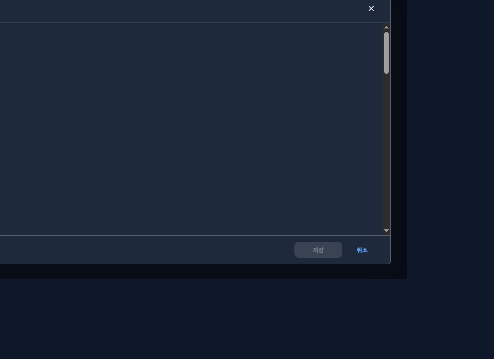

# 20261007_008 공통 모달 테마 배경 통일 결과

## 변경 내용

- `CommonDialog` 기본 표면색을 라이트 `#ffffff`, 다크 `#1e293b`로 명시했다.
- paper, header, body, footer가 동일한 공통 표면색을 사용하도록 정리했다.
- `surfaceBackgroundColor` 명시값의 우선 적용은 유지했다.
- 문서작성 모달의 흰색 고정을 제거했다. 제목 필드와 에디터의 테마별 배경은 유지했다.

## 검증

- TDD RED: 라이트/다크 공통 본문 배경 회귀 테스트는 기존 `#f4f7fb`/`#0f172a` 결과로 실패했고, 문서작성 다크 통합 테스트는 흰색 강제값 때문에 실패하는 것을 확인했다.
- 집중 CommonDialog 테마 테스트: 3개 통과(라이트 표면, 다크 표면, 명시적 사용자 지정).
- 문서작성 다크 테마 통합 테스트: 1개 통과.
- 변경 파일 lint: 통과.
- `npm run build`: TypeScript 검사 및 Vite 프로덕션 빌드 통과.
- 공유 브라우저에서 375px, 768px, 1280px를 확인했다. 모든 크기에서 paper/header/body/footer가 `rgb(30, 41, 59)`였고 페이지 가로 넘침은 없었다. 에디터 고유 배경은 `rgb(15, 23, 42)`로 유지됐다.
- 다크 모달 캡처는 화면에 열려 있던 문서 본문과 페이지 데이터를 숨긴 상태로 저장했다.

## 기존 기준 테스트 실패

변경 전 기준 실행 `npm run test -- tests/common-dialog.test.tsx tests/document-write-page.test.tsx`에서 이번 변경과 무관한 기존 실패 2건을 확인했다.

- `common-dialog.test.tsx`: 모달 크기 테스트가 `maxWidth`/`maxHeight` 스타일 노출을 기대하지만 현재 MUI 렌더 결과에 노출되지 않는다.
- `document-write-page.test.tsx`: 에디터 패널 flex/min-height 스타일 검증이 현재 렌더 결과와 일치하지 않는다.

두 실패는 이번 테마 표면 범위 밖이므로 수정하지 않았다. 집중 테마 테스트, lint, build는 모두 성공했다.

## 스크린샷

## 영향 범위

공통 다이얼로그 표면과 문서작성 다이얼로그 호출부만 변경했다. API, 입력/저장 동작, 다이얼로그 레이아웃, 에디터 전용 표면, 백엔드 및 DB는 변경하지 않았다.
